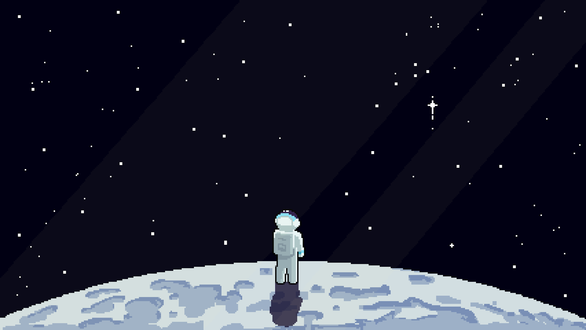
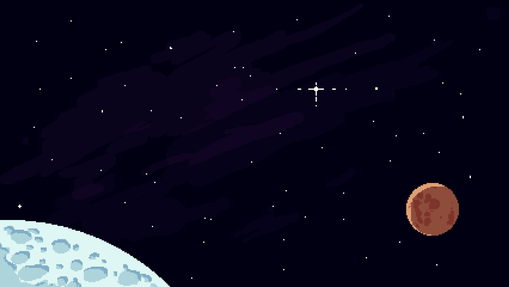

# Uvod u JavaScript
---


# O JavaScriptu
* Nastao 1995. od strane NetScapea
* Jedan od najpopularnijih programskih jezika
* Može se koristiti za:
    * frontend (Javascript + React, Vue, Angular)
    * backend (Node.js)
    * desktop aplikacije (Electron)
    * mobilne aplikacije (React Native)

---


# Osnovna sintaksa

* Skriptni jezik, interpreter evaluira liniju po liniju
* Nema potrebe za main funkcijom
* Osnovna sintaksa bliska C-u ili Javi (zagrade, ; itd.)
* Znak ; nije obavezan ako nije naveden striktni mod na početku fajla

`
"use strict"
`

<br /><br /><br /> 
<!-- br-ovi samo za potrebe da se digne tekst -->

---


# JavaScript ≠ Java

### Primer osnovnog Hello World programa:

<div class="columns">

<div>
<h4> Java </h4>

```java
class Program {
    public static void main(String[] args) {
        System.out.println("Hello World");
    }
}
```
</div>

<div>
<h4> JavaScript </h4>

```javascript
console.log("Hello World");
```
</div>
</div>

---
<!-- TODO -->


# Pitanja?

---


# Hvala na pažnji!